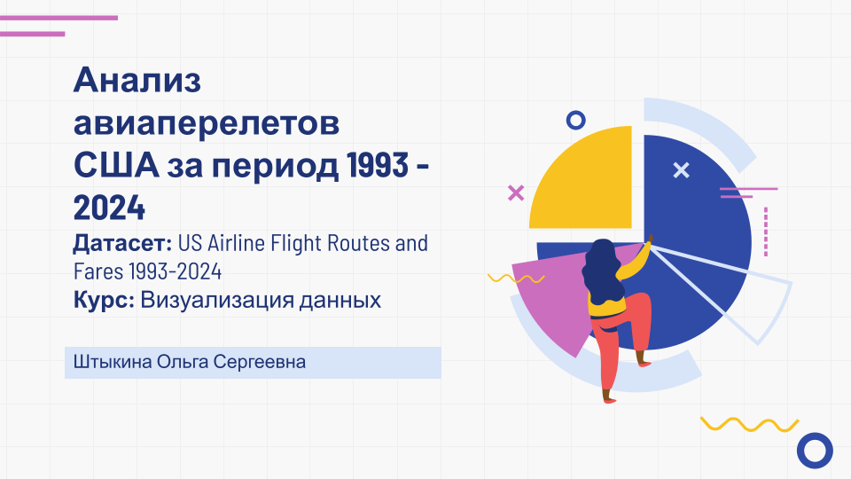
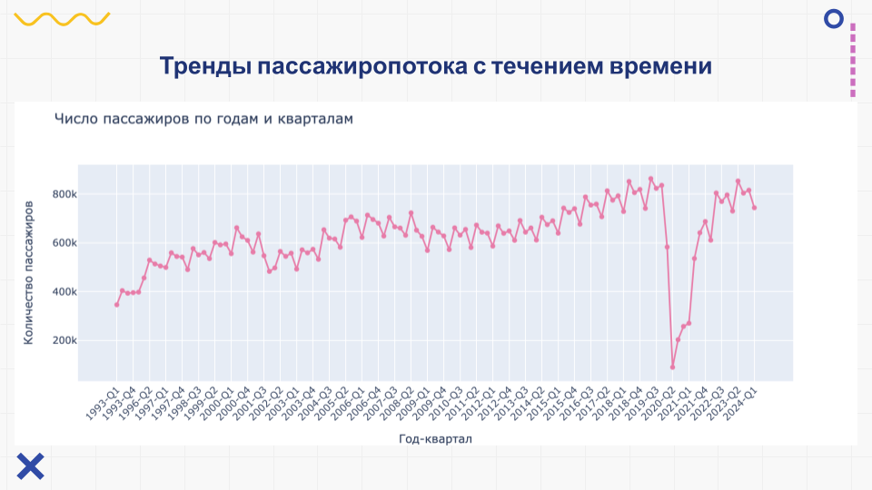
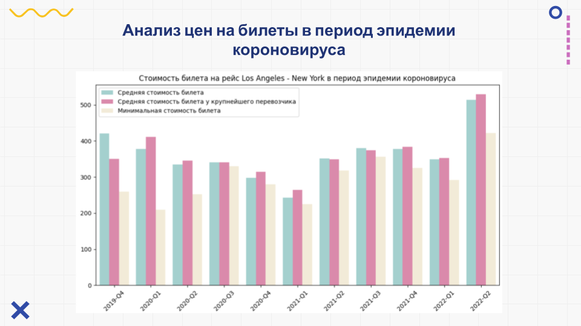
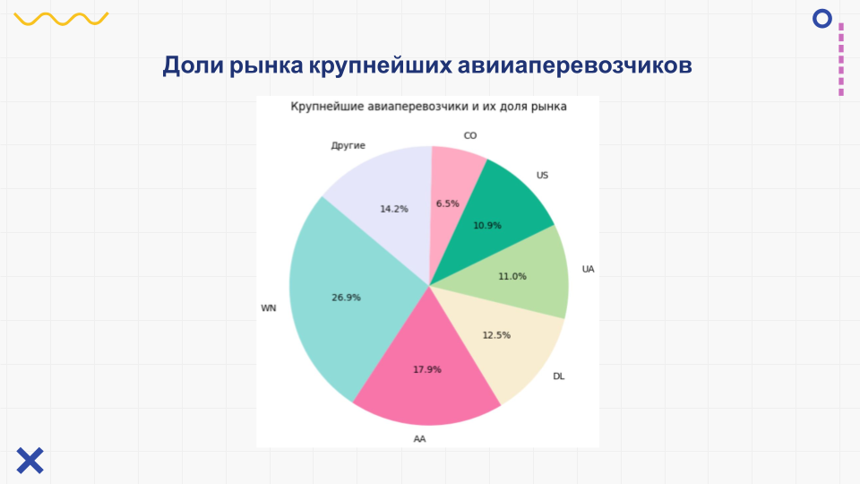

## Итоговый проект по предмету "Визуализация данных" (ИТМО, 2024)

В данной работе анализируется датасет авиаперелетов в США, 1993-2024 ([ссылка на Kaggle](https://www.kaggle.com/datasets/bhavikjikadara/us-airline-flight-routes-and-fares-1993-2024)). 

